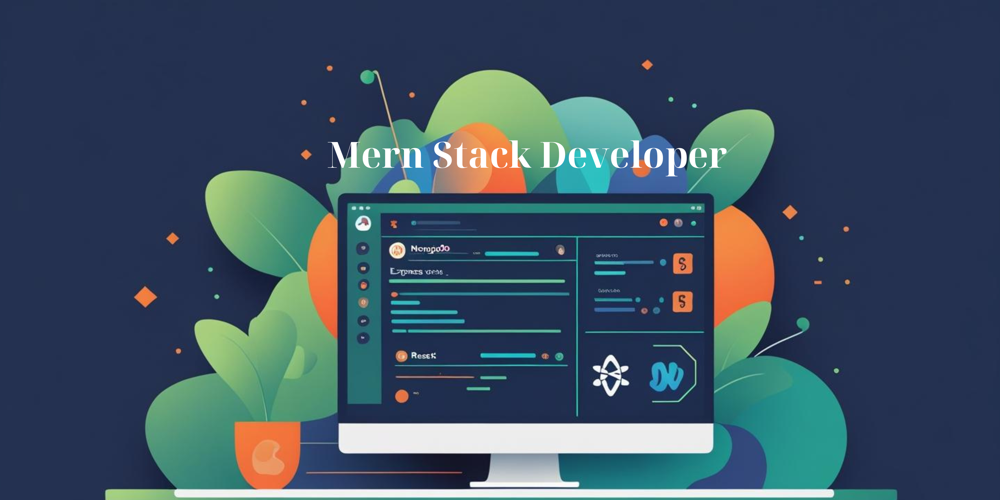

<h1 align="center">Hi, I'm Taherun Nasa Toma 👋</h1>
<h3 align="center">MERN Stack Developer</h3>

---

## 🙋‍♀️ About Me

I am a passionate MERN Stack Developer focused on building full-stack web applications with modern tools and best practices.

- 🔭 I’m currently working on a **Car Rental System**
- 🌱 I’m exploring **Node.js**
- 💻 Practicing real-world projects to strengthen my development skills
- 🎯 Focused on building user-friendly and responsive web apps

---

## 💼 Skills

  
  
  
  
  
  
  

---

## 📫 Connect with Me

  
  
  

---

# 📊 GitHub Stats:
 
 

---

